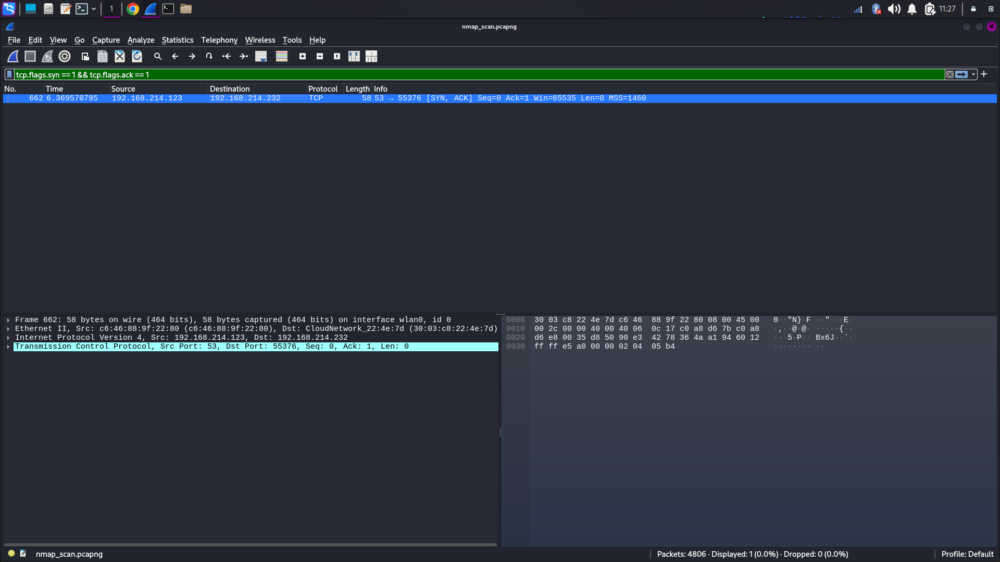
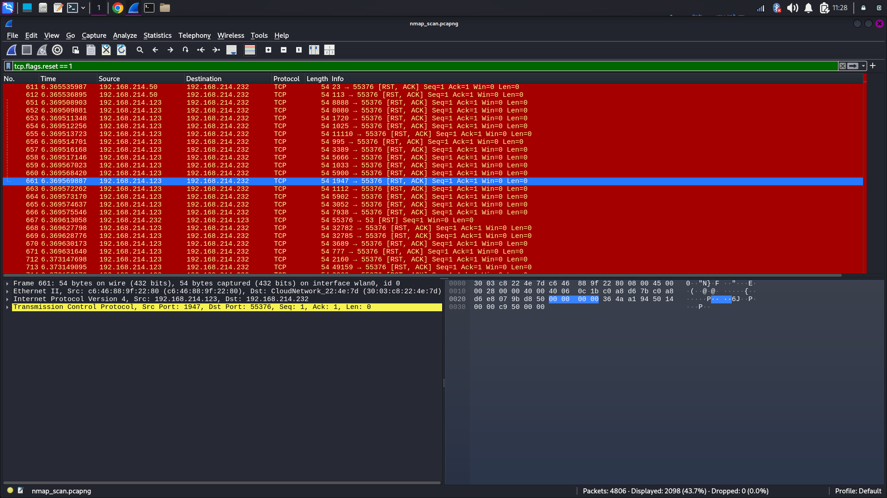

# 🔍 Task 1: Local Network Port Scanning

## 📘 Overview
This task is part of a Cyber Security Internship where the objective is to discover open ports on devices in a local network using **Nmap** and optionally **Wireshark**. Port scanning helps identify services running on the network and understand potential vulnerabilities.

---

## 🧰 Tools Used
- [Nmap](https://nmap.org/) – Network mapping and port scanning tool
- [Wireshark](https://www.wireshark.org/) – Packet analyzer (optional)
- Kali Linux (used for executing scans)

---

## 📡 Scanning Steps

1. **Identify Local IP Range**
   - Used IP range: `192.168.214.0/24`

2. **TCP SYN Scan**
   ```bash
   nmap -sS 192.168.214.0/24 -oN scan_result.txt
   ```

3. **Operating System Detection**
   ```bash
   nmap -A 192.168.214.0/24 -oN os_scan_result.txt
   ```

4. **Vulnerability Scan**
   ```bash
   nmap --script vuln 192.168.214.0/24 -oN vuln_scan.txt
   ```

5. **Packet Capture with Wireshark**
   - Captured packets during the scan are saved in `nmap_scan.pcapng`.

---

## 🧾 Results Summary

| IP Address         | Open Ports     | OS / Service Info                             |
|--------------------|----------------|-----------------------------------------------|
| 192.168.214.50     | None           | All ports closed                              |
| 192.168.214.123    | 53/tcp         | dnsmasq 2.51, Android/Linux 4.X               |
| 192.168.214.232    | 22/tcp, 902/tcp| OpenSSH 10.0p2, VMware Auth Daemon, Linux 5.X |

---

## 🖼️ Screenshots

| Open Port (53) on Android Device | Closed Port Host |
|-------------------------------|-------------------|
|    |  |

---

## 🔐 Key Concepts Demonstrated

- **Port Scanning**: Discovered live hosts and services running on them.
- **TCP SYN Scan**: Used to stealthily check for open TCP ports.
- **OS Fingerprinting**: Identified underlying OS and services.
- **Vulnerability Awareness**: Basic reconnaissance for exposure points.

---

## 📁 Files Included

- `scan_result.txt` – SYN scan result  
- `os_scan_result.txt` – OS detection scan  
- `vuln_scan.txt` – Vulnerability scan result  
- `nmap_scan.pcapng` – Packet capture file  
- `Open_port.png` / `Close_port.png` – Screenshots

---

## ✅ Task Completed
All objectives were successfully completed and documented.  
You can submit this GitHub repository link in the internship portal.
